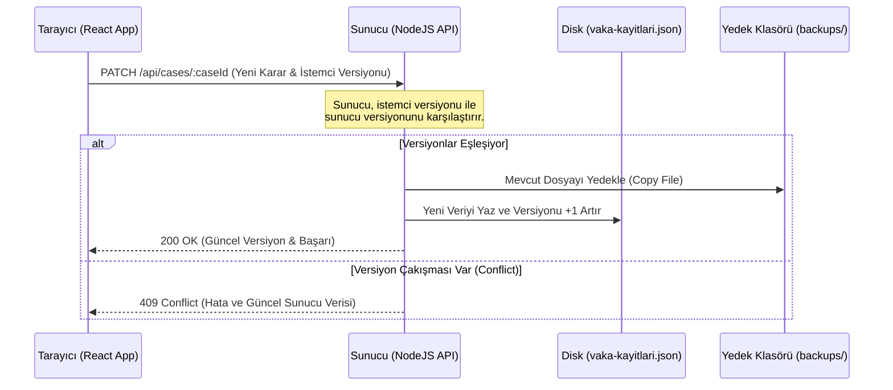

# Radyoloji Konsensus Sistemi - Proje Detay Raporu

Bu rapor, **Radyoloji Konsensus Sistemi** (Acil Görüntüleme Değerlendirme & Radyoloji Karar Destek Sistemi) yazılımının ne işe yaradığını, mimarisini, veri kayıt yapısını ve iş akışını detaylandırmak amacıyla hazırlanmıştır.

---

## 1. Proje Ne İş Yapıyor? (Genel Bakış)

Radyoloji Konsensus Sistemi; acil servise başvuran hastaların semptomları, hayati bulguları (vital signs), fiziksel muayene bulguları ve özel durumları (gebelik, böbrek yetmezliği, metal implant vb.) ışığında **klinik karar destek** sağlayan ve **iki bağımsız radyolog uzmanının (Doktor A ve Doktor B)** ortak konsensusuna dayalı bir değerlendirme yapılmasını kolaylaştıran web tabanlı bir medikal yazılımdır.

### Temel Özellikler:
*   **AI Klinik Karar Destek (Rule-Based AI Engine):** Hastanın şikayet ve bulgularını analiz ederek en uygun görüntüleme yöntemini (örn. Kontrastsız BT, Kontrastlı MR vb.), aciliyet seviyesini (triyaj) ve klinik gerekçesini (rationale) önerir.
*   **Çift Uzman Değerlendirme (Double-Blind / Consensus Review):** Vakalar iki ayrı uzman (Doktor A ve Doktor B) tarafından bağımsız olarak değerlendirilir.
*   **Çakışma Önleme ve Versiyonlama:** İki doktorun aynı anda çalışması durumunda verilerin birbirinin üzerine yazılmasını engelleyen iyimser eşzamanlılık kontrolü (Optimistic Concurrency Control) ve otomatik yedekleme mekanizması barındırır.
*   **İnce Ayar (Fine-Tuning) Veri Çıktısı:** Doktorların onayladığı, reddettiği veya düzenlediği vakalardan elde edilen veriler, ileride makine öğrenmesi modellerini eğitmek amacıyla uygun formatta (`JSON`) dışa aktarılabilir.

---

## 2. Mimari Yapı

Proje, oldukça yalın ve hızlı çalışan iki katmandan oluşmaktadır:

*   **Frontend (İstemci):** React JS (Create React App tabanlı). Kullanıcı arayüzünde modern, dinamik ve HSL tabanlı temalandırma (karanlık/aydınlık mod desteği) kullanılmıştır. Lucide-React ikon kütüphanesinden yararlanılmıştır.
*   **Backend (Sunucu):** Saf Node.js (HTTP modülü kullanılarak oluşturulmuş hafif bir REST API). Express gibi ağır frameworkler yerine saf HTTP sunucusu ve statik dosya sunumu için `serve-static` kullanılmıştır. Şifre doğrulama için `bcrypt` entegrasyonu vardır.

---

## 3. Veri Saklama Mekanizması ve Kayıt Yerleri

Sistemde veriler veri tabanı yerine **JSON dosyaları** üzerinde saklanır ve güncellenir. Ayrıca istemci tarafında veri kaybını önlemek için tarayıcının **localStorage** alanı yedekleme amacıyla kullanılır.

### A. Ana Veri Klasörleri ve Dosyaları

| Dosya / Klasör Yolu | Açıklama |
| :--- | :--- |
| `src/data/hasta_veri.json` | **Statik İlk Veri Seti:** Sisteme ilk kez yüklenen ham hasta vakalarının listesidir. |
| `server/data/vaka-kayitlari.json` | **Aktif Veri Dosyası (Veritabanı):** Sunucu başladığında eğer bu dosya yoksa `src/data/hasta_veri.json` kopyalanarak oluşturulur. Doktorların yaptığı tüm güncellemeler, onaylar, reddetmeler ve veri revizyonları anlık olarak bu dosyaya yazılır. |
| `server/data/doctors.json` | **Doktor Kullanıcı Kayıtları:** Sistemde tanımlı olan doktorların kullanıcı bilgileri, isimleri ve `bcrypt` ile şifrelenmiş şifre hash'lerini barındırır. |
| `server/data/backups/` | **Otomatik Yedekleme Klasörü:** Her başarılı güncellemede (PATCH/PUT), çakışma durumlarında veri kaybını önlemek için aktif vaka dosyasının zaman damgalı bir yedeği (örn. `vaka-kayitlari-2026-06-25T08-00-00-000Z.json`) bu klasöre kaydedilir. Maksimum 50 yedek tutulur, eski yedekler otomatik silinir. |
| **Tarayıcı LocalStorage** (`radyoloji-vaka-overlay-v1`) | **İstemci Tarafı Yedek:** Tarayıcıda doktorların yaptığı değişiklikler (overlay formatında) yerel olarak saklanır. Sunucu çevrimdışı olsa dahi bu veri yerel olarak korunur. |

### B. Otomatik Yedekleme ve Versiyonlama Akışı

---

## 4. Kullanıcı Rolleri ve Konsensus Akışı

Uygulamaya giriş yapan kullanıcılar `server/data/doctors.json` dosyasındaki tanımlamalara göre rollerine ayrıştırılır:

1.  **Dr. Serdar Solak (ID: `doktor-01`):** Sistem tarafından **Doktor A (Slot A)** olarak atanır.
2.  **Dr. Ayşe Kaya (ID: `doktor-02`):** Sistem tarafından **Doktor B (Slot B)** olarak atanır.

### Konsensus Nasıl Sağlanır?
*   Bir vakanın statüsü şu 3 durumdan birindedir:
    1.  `bekliyor`: İki doktor da henüz bu vaka hakkında karar bildirmemiş.
    2.  `kismen_islendi`: Sadece bir doktor karar bildirmiş.
    3.  `tamamlandi`: İki doktor da kararını sisteme kaydetmiş.
*   **Fikir Birliği (Priority Consensus):** Eğer hem Doktor A hem de Doktor B aynı vaka için aynı **Görüntüleme Seçimini**, **Tedavi Kararını** ve **Triyaj (Aciliyet) Seviyesini** seçmişse, bu vaka sistemde **"İki Uzman Onaylı"** (`iki_uzman_onayli`) etiketiyle işaretlenir. Aksi halde vaka tek bir doktor onayında kalmışsa veya kararlar farklıysa **"Uzman Onaylı"** (`uzman_onayli`) olarak işaretlenir.

---

## 5. Yapay Zeka Karar Destek Motoru (`aiSuggestionEngine.js`)

Sistemde bulunan karar motoru, American College of Radiology (ACR) standartlarına benzer kurallara dayanan gelişmiş bir **skor tabanlı uzman sistemdir**.

1.  **Semptom ve Şikayet Analizi:** Giriş yapılan ana şikayet ve semptom listesinde anahtar kelime eşleştirmesi yapılır (Örn: "akut inme" şüphesinde; `hemiparezi`, `afazi`, `konuşma bozukluğu` gibi kelimeler aranır).
2.  **Skorlama:** Her klinik senaryonun bir taban skoru bulunur. Eşleşen semptomlar ve aciliyet durumuna göre bu skor yükseltilir.
3.  **Güvenlik Filtresi (Kontrendikasyon Analizi):** Karar motoru, en yüksek puan alan görüntüleme yöntemini önermeden önce hastanın kontrendikasyonlarını kontrol eder.
    *   *Örneğin:* En yüksek skor alan yöntem "Kontrastlı BT" ise ancak hastanın **Kontrast Alerjisi** veya **Böbrek Yetmezliği (Renal Function)** varsa, sistem otomatik olarak alternatife yönelir veya uyarı verir.
    *   *Örneğin:* Hastada **Metal İmplant** varsa MR yerine BT alternatifleri önerilir.
    *   *Örneğin:* Hasta **Gebe (Pregnancy)** ise radyasyon içeren BT yerine MR veya Ultrason önceliklendirilir.

---

## 6. Güvenlik Önlemleri ve Çakışma Çözümleri

*   **Bcrypt Şifreleme:** Doktor şifreleri veritabanında (JSON) ham olarak değil, güvenli tuzlama (salt) içeren bcrypt hash formatında saklanır.
*   **Oturum Yönetimi (Sessions):** Giriş yapan doktorlara kriptografik olarak güvenli 32-byte token atanır. Oturumlar 24 saat boyunca geçerlidir ve sunucu arka planda her 5 dakikada bir süresi dolan oturumları temizler.
*   **Race-Condition (Yarış Durumu) Koruması:** İki doktorun aynı vaka üzerinde aynı anda çalışıp birbirlerinin verilerini ezmesini engellemek için her vaka `_version` alanı taşır. İstemciden gelen istekteki versiyon sunucudakiyle eşleşmezse sunucu isteği reddeder ve güncel veriyi göndererek istemcinin arayüzünü günceller.
